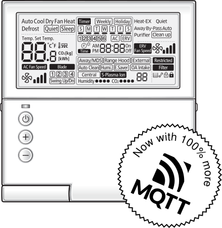
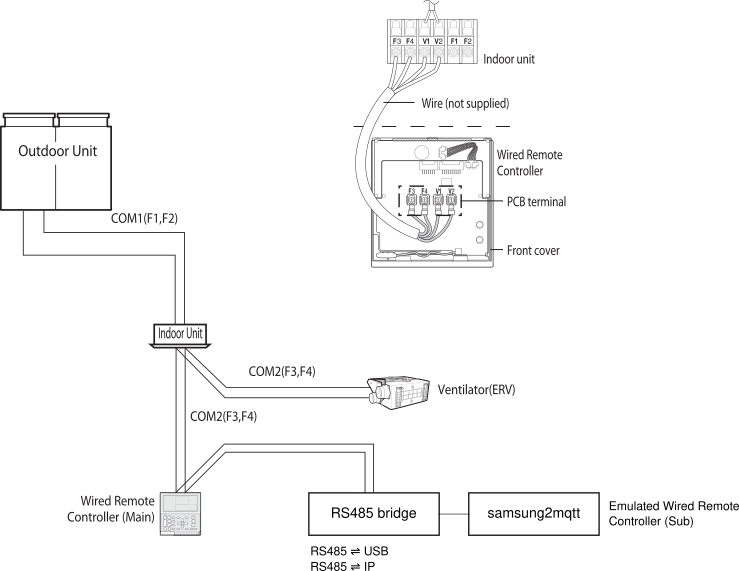

# Samsung HVAC ⇌ MQTT

Control of select Samsung residential HVAC units over MQTT by emulating a secondary wired remote control.

## Planned features:

- Emulate a secondary wired remote control for correct integration onto the WRC bus.
- Report status to MQTT topics.
- Allow changing of parameters via MQTT topics.

## Status

- [x] Frame Decoding
- [ ] Command Decoding (partially complete)
- [ ] Sub WRC emulation (in-progress)
- [ ] MQTT integration

This project also contains partial emulators for the Main WRC, Indoor Units, and ERVs to aid in reverse-engineering the WRC protocol.

## Compatibility and Limitations

My HVAC system is single zone, single unit, single remote.
I'm unable to test the more advanced features supported on more complex systems such as
multiple zones, multiple indoor units, ERV/ventilators, blade control, humidity/CO² reading, etc, though I have
had some success reverse engineering the protocol to implement partial support for these features.

Notably Command `0xA0` ("Change Indoor Unit Settings") still has a number of unknowns fields.
As this is a blanket "change all" settings command I cannot predict how this functions on systems that support additional untested features.

The COM2/WRC bus possibly has two protocol versions: non-NASA and NASA.
This project currently only supports the non-NASA variant.
If your controller model number ends with `N` the bus is using the NASA variant.

My system topology is:

| Component | Model |
| --- | --- |
| Outdoor Unit | `AC120HCAFKH/SA` |
| Indoor Unit | `AC120HBHFKH/SA` |
| Wired Remote Control | `MWR-WE10` |

My assumption is that the following wired remote controls talk the same protocol:

| Model | Description |
| --- | --- |
| `MWR-WE10` | Wired Remote Controller |
| `MWR-WE11` | Wired Remote Controller |
| `MWR-WE13` | Wired Remote Controller |
| `MWR-SH00` | Simple Wired Controller |
| `MWR-WH00` | Wired Remote Controller |
| `MWR-WH01` | Wired Remote Controller |

## Background

Samsung HVAC units have two RS-485 control buses: COM1 (F1/F2) and COM2 (F3/F4). 
The first (COM1) connects the _indoor units_ (such as ceiling cassettes, in-roof duct units, and wall-mount consoles) to
their counterpart _outdoor units_.
The second (COM2) connects the _indoor units_ to the _wired remote controls_ (WRC).

This project currently focuses on the second (COM2) bus (which this project terms the _WRC bus_).

| Bus | Baud | Settings |
| --- | --- | --- |
| COM1 | 9600 | 1 stop bit, Even parity, 8 data bits |
| COM2 | 2400 | 1 stop bit, Even parity, 8 data bits |

## Glossary

Some useful terminology definitions:

ERV: Energy Recovery Ventilator

FJM: Free Joint Multi

EMS: ECO Heating System

DVM: Digital Variable Multi

VRF: Variable Refrigerant Flow

MDS: Motion Detect Sensor

EEV: Electronic Expansion Valve

RMC address: indoor unit group address

SAC: System Air-conditioner Control

NASA: ? 
- seems to be for newer/higher power/commercial units
- completely different protocol (apparently)
- The wired remotes come in NASA (e.g. `MWR-WE10N`) and non-NASA variants (`MWR-WE10`).
- RAC (Non-Nasa Protocol), CAC (Nasa Protocol), 
- Software: SAMSUNG SNET PRO (Old protocol), SNET PRO 2 (NASA Protocol)

RAC: Residential AC

CAC: Commercial AC

AHU: Air Handling Unit

## Thanks

Many thanks to [Danny De Gaspari](https://github.com/DannyDeGaspari) for his excellent work on
[Samsung-HVAC-buscontrol](https://github.com/DannyDeGaspari/Samsung-HVAC-buscontrol).
Without his initial reverse enginering work this project wouldn't be possible.
