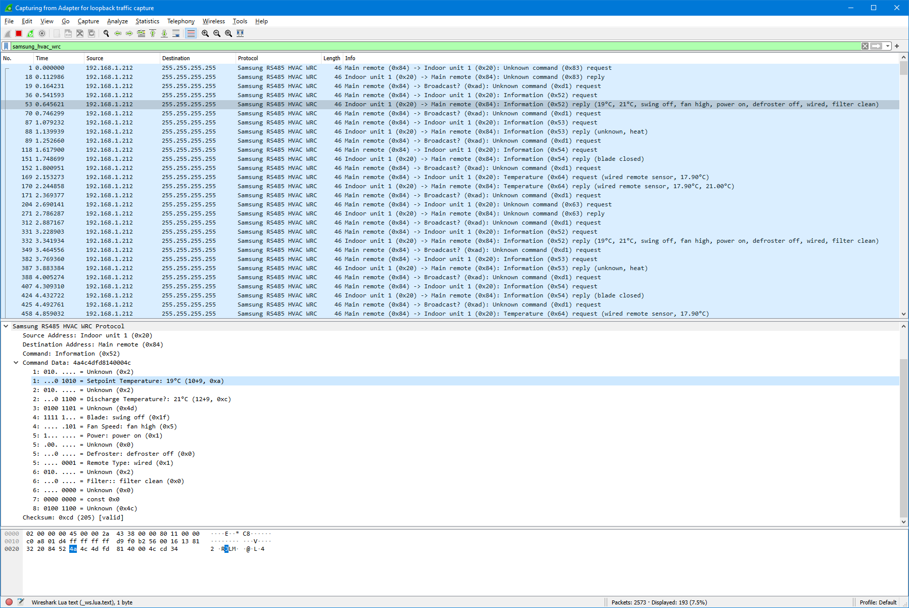

# samsung-hvac-mqtt

The goal of this project is to be a bidirectional bridge between Samsung residential HVAC units and MQTT.


## Background

Samsung HVAC units have two RS-485 control buses: COM1 (F1/F2) and COM2 (F3/F4). 
The first (COM1) connects the _indoor units_ (such as ceiling cassettes, in-roof duct units, and wall-mount consoles) to
their counterpart _outdoor units_.
The second (COM2) connects the _indoor units_ to the _wired remote controls_.

This project currently focuses on the second (COM2) bus (which this project terms the _WRC bus_).


## Planned features:

- Emulate a secondary wired remote control for correct integration onto the WRC bus.
- Report status to MQTT topics.
- Allow changing of parameters via MQTT topics.
- Support running on multiple devices, including embedded RS-485

## Compatibility and Limitations

My HVAC system is single zone, single unit, single remote.
I'm unable to reverse engineer and test the more advanced features supported on more complex systems such as
multiple zones, multiple indoor units, ERV/ventilators, blade control, humidity/CO² reading, etc.

The COM2/WRC bus seems to have two protocol versions: non-NASA and NASA.
This project currently only supports the non-NASA variant.
If your controller model number ends with `N` the bus is using the NASA variant.

My system topology is:

| Component | Model |
| --- | --- |
| Outdoor Unit | `AC120HCAFKH/SA`
| Indoor Unit | `AC120HBHFKH/SA`
| Wired Remote Control | `MWR-WE10`

My assumption is that the following wired remote controls talk the same protocol:

| Model | Description |
| --- | --- |
| `MWR-WE10` | Wired Remote Controller |
| `MWR-WE11` | Wired Remote Controller |
| `MWR-WE13` | Wired Remote Controller |
| `MWR-SH00` | Simple Wired Controller |
| `MWR-WH00` | Wired Remote Controller |
| `MWR-WH01` | Wired Remote Controller |


## Wireshark Protocol Dissector

Included is a Wireshark dissector plugin, written in Lua.
This dissector decodes COM2/WRC bus packets for easy inspection and visualisation.

The dissector expects packets to be sent via UDP on port 45654.
A small bridging script exists to read packets from an RS-485 serial port and sends them as broadcast UDP packets.

1. Start the dump script:
   
   ```
   python dump.py /dev/ttyUSB0
   ```
   
   The serial port argument can either be a local device (such as `/dev/ttyUSB0`) or a URL,
   which permits reading from remote ports over the network.
   See the [pySerial documentation](https://pythonhosted.org/pyserial/url_handlers.html#urls)
   for a list of accepted URL types.
   
   I've only tested this with a [HF2211 Wifi/Ethernet to RS-232/RS-485 Server](http://www.hi-flying.com/rs232-rs485-rs422-to-wifi-serial-server) box.


   
2. Start Wireshark with the plugin. Either:
    
   - copy `samsung-dissector.lua` into your Wireshark plugins directory; or
   - start Wireshark with `-X lua_script:/path/to/samsung-dissector.lua`.
    
3. Stark capturing on a network interface that can receive the UDP broadcast packets.

4. Set the filter to `samsung_hvac_wrc` to only display Samsung WRC bus packets.



Alternatively, with the plugin installed, existing protocol dumps can be inspected.

Protocol dumps of existing communications are in the `dumps` directory.


## Thanks

Many thanks to [Danny De Gaspari](https://github.com/DannyDeGaspari) for his excellent work on
[Samsung-HVAC-buscontrol](https://github.com/DannyDeGaspari/Samsung-HVAC-buscontrol).
Without his initial reverse enginering work this project wouldn't be possible.